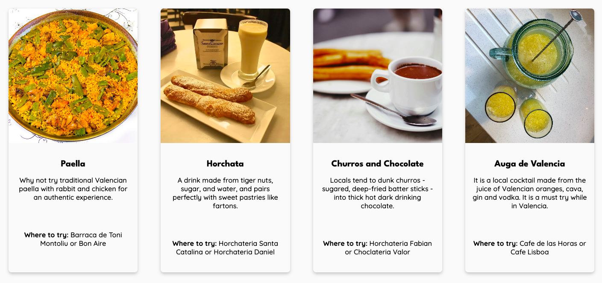

# [Experience Valencia](https://desireealexia.github.io/Experience-Valencia/index.html)


Experience Valencia is a comprehensive, user-friendly online guide for tourists visiting Valencia, Spain, providing information on attractions, cuisine and practical tips. This guide can also be used by nomads, expats, and residents of Spain.

## Table of Contents

- [UX](#ux)
  - [Project Goals](#project-goals)
  - [User Stories](#user-stories)
  - [Design](#design)
  - [Wireframes](#wireframes)
- [Features](#features)
  - [All Pages](#all-pages)
  - [Main Pages](#main-pages)
  - [Home Page (index.html)](#home-page)
  - [Explore Valencia Page (explore.html)](#explore-valencia-page)
  - [Contact Us Page (contact.html)](#contact-us-page)
  - [404 Page (404.html)](#404-page)
  - [Thank You Page (thank-you.html)](#thank-you-page)
  - [Future Features](#future-features)
- [Feedback](#feedback)
  - [Peers](#peers)
  - [Tutor](#tutor)
- [Accessibility](#accessibility)
- [Technologies Used](#technologies-used)
  - [Languages](#languages)
  - [Design & Development Tools](#frameworks-libraries--programmes-used)
- [Manual Testing](#manual-testing)
  - [Features Testing](#features-testing)
  - [User Stories Testing](#user-stories-testing)
  - [Performance Issues and Solutions](#performance-issues-and-solutions)
  - [Browser Compatibility](#browser-compatibility)
  - [Responsiveness Testing](#responsiveness-testing)
  - [Code Validation](#code-validation)
  - [Bugs](#bugs)
  - [Lighthouse Testing](#lighthouse-testing)
- [Deployment](#deployment--local-deployment)
  - [Deployment (GitHub Pages)](#deployment)
  - [Local Deployment](#local-deployment)
- [Credits](#credits)
  - [Code](#code)
  - [Research and Resources](#research-and-resources)
  - [Media](#media)
  - [Content](#content)

# UX

## Project Goals

The primary goal of the Experience Valencia website is to provide a comprehensive and user-friendly guide to Valencia, Spain. The project aims to achieve the following objectives:

- **Provide Comprehensive Information:** Offer detailed information on Valencia's top attractions and local cuisine to help users plan their trips effectively.
- **Ensure Ease of Navigation:** Design a website that is easy to navigate with a clear and intuitive layout.
- **Visually Appealing and Engaging Experience:** Develop a visually appealing website with a modern design and use high-quality images and engaging content.
- **Offer Essential Tips:** Provide essential tips for users to enhance their visit.

## User Stories

### Client Goals

As the client, I want to achieve the following:

- **Increase Awareness:** Raise awareness of Valencia as a premier travel destination to encourage more tourists to pick Valencia.
- **Easy Navigation:** Ensure users can navigate the website effortlessly.
- **SEO Optimisation:** Optimise website for SEO to rank high in search engines and attract more visitors.
- **Responsive and Accessible Design:** Have the website be responsive and accessible to users on different devices and abilities.

### Visitor Goals

As a first-time visitor, I want:

- **Discover Top Attractions:** To learn about the top attractions in Valencia so that I can plan an enjoyable sightseeing itinerary.
- **Easy Navigation:** To navigate the website easily with a clean layout that helps me find the information I need without hassle.
- **Mobile Accessibility:** To access the website on my mobile device with quick loading times and a responsive design that adapts to different screen sizes.

As a returning visitor, I want:

- **Explore Local Cuisine:** To discover the best local cuisine so I can experience authentic Valencian flavours.
- **Access Essential Tips:** To easily find essential tips and local insights to help me have a better experience in Valencia.

As a frequent visitor, I want:

- **Share Experiences:** To be able to share my own experiences and tips with others to help them make the most out of their visit.
- **Personalised Recommendation:** To receive personalised recommendations.

## Design

### Colour Palette

The colour palette for the Experience Valencia website was selected to reflect the vibrant and dynamic essence of Valencia while ensuring readability and visual harmony. The palette is inspired by the colours of the [Valencian Community Flag](https://encrypted-tbn0.gstatic.com/images?q=tbn:ANd9GcTHDltCMJWOwD_TXM0lBRmdTQM0RO9Ol97DFQ&s) and has been strategically applied across various elements of the website.


Below is a detailed description of each colour and its usage:

#### Background Colour - Off-white (#FAFAFA):

- This light shade is used for the website's background, enhances content visibility and reduces eye strain.

#### Text Colours - Black (#000) and White (#FFF):

- Black is used for primary text elements such as body text and heading. It ensures high contrast against the background, making content clear and easy to read.
- White is applied to text on darker backgrounds or as highlights to ensure visibility and contrast especially in sections with the primary and accent colours.

#### Primary Colour - Blue (#1C5B97)

- **Navigation Menu:** The blue is used for the navigation bar, creating a strong and consistent brand identity.
- **Hero Section Background:** A slightly less opaque blue provides a striking background for the hero section, adding depth and emphasis to the introductory content.
- **Hover State for Clear Button:** Applied to the hover state of the _Clear_ button on the Contact Us form, offering visual feedback.
- **Hover State for Return to Home Page Button:** Applied to the hover state of the _Return to Home page_ button on the 404 and Thank You pages.

#### Secondary Colour - Yellow (#FFCB47)

- **Focused Navigation Link:** This bright yellow is used for focused navigation links, drawing attention to the current page and improving navigation clarity.
- **Essential Tips Cards:** A slightly less opaque yellow is used for the Essential Tips cards on the Home page, adding a warm touch to the section without overwhelming the design.
- **Hover State for Submit Button:** Applied to the hover state of the _Submit_ button on the Contact Us form, creating a noticeable interactive effect.

#### Accent Colour - Red (#DC332E)

- **Navigation Menu Hover:** Red is used for the hover effect on navigation menu items, providing a vibrant and noticeable change.
- **Footer Social Media Icons Hover:** Used for the hover state of social media link icons in the footer, ensuring they catch the user's eye.
- **Explore Valencia Page Buttons:** Used for the attractions and cuisine buttons on the Explore Valencia page, creating a strong visual impact and guiding user interaction.
- **Contact Us Button Hover:** Applied to the hover state of the _Contact Us_ button on the 404 and Thank You pages, making it stand out as interactive.

### Typography

For this website, typography plays a crucial role in enhancing readability and visual appeal. Google Fonts was utilised to ensure high-quality and consistent typography across all pages.

- **Headings:** The font used for heading is _League Spartan_, a bold sans-serif font. This font was chosen for its modern and clean appearance, making it ideal for headings. It provides a strong visual hierarchy and helps highlight important sections and headings on the website.
- **Body text:** The body text uses _Quicksand_, a sans-serif font selected for its readability and friendly, rounded design. This font ensures that the content is easy to read on all devices and provides a pleasant reading experience.


### Imagery

#### Main Images

- **Hero Image:** Features an image of L'Umbracle Terraza, part of the City of Arts and Sciences, to immediately capture the visitor's attention and set the tone for the website.
- **Explore Valencia Page:** Includes images of key attractions such as the City of Arts and Sciences, The Silk Exchange, and popular local dishes. These images were selected to highlight the city's diverse cultural and culinary delights.

#### Icons

- **Social Media Icons:** Used in the footer to ensure a consistent and professional look throughout the website.
- **Home Page and Explore Valencia Page Icons:** Represent different selections and features providing a cohesive visual language across the site.

#### Logo and Favicon

- **Logo:** The Experience Valencia logo consists of three vertical rectangles, each featuring a distinct icon: a plane, a suitcase, and a map pin. The rectangles are coloured in the colours of the Valencian flag — blue, yellow, and red - used throughout the website. Beneath the rectangles, the text “Experience Valencia” is displayed in a clean, readable font. This logo is prominently featured across all pages to maintain brand identity.


- **Favicon:** The favicon is a simplified version of the logo, omitting the text and featuring the three vertical rectangles with the icons. It appears in the browser tab to provide a consistent branding experience.


## Wireframes

I began the design process by sketching initial concepts on paper. This allowed me to explore various layouts quickly and refine the structure before moving to digital tools. Once I was satisfied with the paper sketches, I digitalised them using Figma to create more polished wireframes. These wireframes were essential in planning the layout and structure of each page and ensuring that the design was responsive across different device sizes.

Initially, I designed wireframes for three main pages: a Home page, an Explore Valencia page, and an Essential Tips page. The Essential Tips page was intended to provide essential information for users. However, as the project evolved, I decided to integrate the content from the Essential Tips page into the Home page, eliminating the need for a separate page dedicated to essential tips. This adjustment led me to change the layout of the Home page to accommodate this content and focus the third page on contact functionality, resulting in the creation of the Contact Us page.

### Essential Tips Page Wireframe (Not Implemented):

The original wireframe for this page included a section dedicated to visitor tips and advice. Although it was a useful idea, I ultimately decided to merge this content into the Home page for simplicity and better flow.


### Home Page Wireframe:

This Home Page was adjusted to include the essential tips directly on the page, providing users with an introduction to Valencia and essential tips in one place.


### Explore Valencia Page Wireframe:

The Explore Valencia wireframe focused on showcasing popular attractions and local cuisine.


These wireframes were created to ensure the design was responsive and looked good on different devices. I specifically designed them for three device sizes:

- Mobile: width 576px
- Tablet: width 768px
- Desktop: width 1200px

Since the Contact Us page has a straightforward design, I did not create a wireframe for it. The page was planned and implemented directly in the development phase, focusing on a simple and effective user interface to facilitate easy communication between users and Experience Valencia.

I also did not create wireframes for the 404 and Thank You pages as they were not part of my initial project plan. However, after receiving advice from my mentor, Diego, I recognised the importance of including these pages for a better user experience. Since this decision was made late in the project, I did not have wireframes prepared for these pages.

# Features

The website contains five pages: three main pages which can be accessed using the navigation menu, and two additional pages. The main pages are the Home page, Explore Valencia page and Contact Us page. The additional pages are a Thank You page which appears after form submission, and a 404 page which appears when a user requests a non-existent page.

## All Pages

The website features a responsive design ensuring it looks great on all devices, from mobile phones to desktop computers. Consistent display of the logo across all pages helps maintain brand identity.

## Main Pages

- **Experience Valencia Logo:** Displayed as a banner above the navigation menu, reinforcing brand identity.
- **Responsive Navigation Menu:** Provides easy access to other parts of the site. On mobile devices, the navigation menu collapses into a vertical format, with each link stacked for easy tapping.

|                                                 Mobile                                                  |                                                 Tablet                                                  |                                                  Desktop                                                  |
| :-----------------------------------------------------------------------------------------------------: | :-----------------------------------------------------------------------------------------------------: | :-------------------------------------------------------------------------------------------------------: |
|  |  |  |

- **Footer:** Contains the Experience Valencia favicon, which, when pressed, takes users to the top of the page, acting as a back-to-top feature. Additionally, the footer includes a thank-you message for visiting the website, social media icon links for connecting with Experience Valencia, and copyright text.

|                                      Mobile                                       |                                      Tablet                                       |                                       Desktop                                       |
| :-------------------------------------------------------------------------------: | :-------------------------------------------------------------------------------: | :---------------------------------------------------------------------------------: |
|  |  |  |

## Home Page (index.html)

- **Hero Section:** Features a captivating image of L'Umbracle Terraza in the City of Arts and Science, accompanied by a brief introductory text to engage users.


- **Introduction Text:** Provides an overview of Valencia, highlighting its appeal as a travel destination.


- **Essential Tips Section:** Offers practical advice and useful information for users, such as modes of transport, weather and local customs.

|                                                     Mobile                                                     |                                                     Tablet                                                     |                                                     Desktop                                                      |
| :------------------------------------------------------------------------------------------------------------: | :------------------------------------------------------------------------------------------------------------: | :--------------------------------------------------------------------------------------------------------------: |
|  |  |  |

## Explore Valencia Page (explore.html)

- **Hero Section:** Features a captivating image of L'Umbracle Terraza in the City of Arts and Science, accompanied by a brief introductory text to set the tone for exploring the city.


- **Introduction Text:** Provides an overview of the page, encouraging users to explore the content further.


- **Quick Navigation Buttons:** Buttons are provided to quickly scroll to the attractions and cuisine sections, enhancing each user experience by providing quick access to relevant content.

|                                                         Mobile                                                          |                                                          Desktop                                                          |
| :---------------------------------------------------------------------------------------------------------------------: | :-----------------------------------------------------------------------------------------------------------------------: |
|  |  |

- **Attractions Section:** Detailed information on popular tourist attractions is presented to inform users. Each attraction includes a brief description and a high-quality image, showcasing places like the City of Arts and Sciences, Valencia Cathedral, The Silk Exchange, and Bioparc Valencia.


- **Cuisine Section:** A showcase of local cuisine highlights the unique flavours of Valencia. Each dish, such as Paella, Horchata, Churros and Chocolate, and Fideua, is described briefly and paired with an appetising image.


## Contact Us Page (contact.html)

- **Hero Section:** Features a captivating image of L'Umbracle Terraza in the City of Arts and Sciences, along with introductory text to invite visitors to get in touch.


- **Introduction Text:** Details the reasons why users might want to contact Experience Valencia and how they can do it.


- **Contact Form:** A form is provided for users to get in touch with Experience Valencia. The form includes:

  - Fields for the user's name, email, subject (enquiry, feedback, or other), and a textarea for users to leave their message.
  - Required fields for the name, email, and message to ensure that all necessary information is provided.
  - The subject field is set to default to "enquiry" for user convenience.
  - A Submit button to send the form, which redirects users to the Thank You page upon successful submission.
  - A Clear button to reset the form, allowing users to start over if needed.

  

## 404 Page (404.html)

- **Error Message:** Indicates that the page was not found, helping users understand what went wrong.
- **Navigation Buttons:** Two buttons are provided—one to go return to the Home page and another to go to the Contact Us page - helping guide lost users back to relevant content.


## Thank You Page (thank-you.html)

- **Thank You Message:** A message thanking the user for submitting the form, confirming that their message has been received.
- **Navigation Buttons:** A button is provided to return users to the Home page, ensuring they can continue exploring the site.


## Future Features

- **Reviews:** Allow users to leave and read reviews of attractions and cuisine, providing valuable insights and enhancing user engagement.
- **Individual Attraction and Cuisine Pages:** Separate pages for each attraction and dish will be created to provide detailed information and better content.
- **Restaurant Recommendations:** Showcase restaurant recommendations from users, helping other users find the best places to eat in Valencia.
- **Events and Festivals Section:** Include a section for upcoming events and festivals in Valencia, helping visitors plan their trips around local events.
- **Interactive Map:** Enhance the Explore Valencia page with a map feature that allows users to get directions easily to different attractions and restaurants, improving their overall experience.
- **Multi-Language Support:** Implement a feature to make the website available in multiple languages, allowing the user to view content in their preferred language and enabling accessibility for a global audience.

# Feedback

Throughout the development of this project, I received valuable feedback from my mentor, tutor, and peers, which helped me refine and improve the final product.

## Peers

- **Good Layout and Use of Colors:** My peers appreciated the overall design and colour scheme, noting that it provided a visually pleasing and cohesive user experience.
- **Effective Purpose Fulfilment:** They also mentioned that the website effectively serves its intended purpose, providing clear and relevant information about Valencia.
- **Menu-Bar Text Size:** One suggestion from my peers was to increase the size of the text in the menu bar to improve readability.

|                                                        Old                                                        |                                                         Updated                                                         |
| :---------------------------------------------------------------------------------------------------------------: | :---------------------------------------------------------------------------------------------------------------------: |
|  |  |

## Tutor

- **Reduce On-Screen Text:** My tutor advised reducing the amount of on-screen text to make the content more digestible and user-friendly. This feedback led to a more concise and focused presentation of information across the site.

|                                                              Old                                                               |                                                               Updated                                                                |
| :----------------------------------------------------------------------------------------------------------------------------: | :----------------------------------------------------------------------------------------------------------------------------------: |
|                 |                 |
|  |  |

# Accessibility

Ensuring accessibility is a fundamental aspect of creating an inclusive and user-friendly website. The Experience Valencia website was designed with accessibility in mind to accommodate users of all abilities and devices.

- **Semantic HTML:** Used semantic HTML elements, such as `<header>`, `<nav>`, `<main>`, `<section>` and `<footer>` to structure the content on the website. This improves the website's readability for screen readers and other assistive technology.
- **Clear and Consistent Headings and Labels:** Headings are used in hierarchical order - `<h1>` for main titles and `<h2>` for section headings - to create a logical flow of information. This helps users who rely on screen readers to navigate through content efficiently. Form fields and interactive elements include descriptive labels to ensure clarity and usability for all users.
- **`alt` Text for All Images:** All images on the website include descriptive `alt` attributes to provide context and information for users who rely on screen readers. This ensures that visual content is accessible to users with visual impairments.
- **Hover States and Visual Feedback:** Visual feedback, such as hover states on buttons and interactive elements is provided to indicate that elements are interactive.
- **`aria-label` on Links and Interactive Elements:** Added `aria-label` attributes to interactive elements where necessary to provide additional context for screen readers.
- **Keyboard Navigation:** All interactive elements are accessible via keyboard navigation. Users can tab through links, form fields and buttons, and use the Enter key to activate them.
- **Text Contrast:** Verified that text and background colour combinations meet accessibility standards using the Accessible Colour Palette Builder and WebAIM Contrast Checker. This ensures sufficient contrast ratios for readability, especially for users with low vision or colour blindness.


- **Focus Indicators:** Applied clear focus indicators (such as colours) on interactive elements to help users who navigate via keyboard, this helps users know which element is currently focused.
- **Responsive Design:** Website is designed to be responsive and functional on various devices and screen sizes. This includes making sure that all interactive elements and content are accessible and usable on mobile devices, tablets and desktop computers.

# Technologies Used

## Languages

- **HTML5:** Used for the website's structure and content; HTML5 supports semantic elements which enhances accessibility and improve SEO.
- **CSS3:** Applied for styling, and layout and provides the ability to create responsive designs with media queries.

## Design & Development Tools

- **[Figma](www.figma.com):** Used for creating wireframes and planning the layout and structure of the website.
- **[Canva](https://www.canva.com/):** Utilised for designing the Experience Valencia logo and favicon.
- **[Coolors](https://coolors.co/):** Used to create the website's colour palette, ensuring that they reflected the colours of the Valencian Community flag and worked well together.
- **[Accessible Colour Palette Builder](https://toolness.github.io/accessible-color-matrix/)**: This tool was essential in confirming that the chosen combinations met accessibility standards, particularly regarding text contrast.
- **[WebAIM Contrast Checker](https://webaim.org/resources/contrastchecker/)**: Used to verify the contrast ratios between background and foreground colours, ensuring that the website's text is legible and meets accessibility guidelines.
- **[Cloud Convert](https://cloudconvert.com/)** and **[Free Convert](https://www.freeconvert.com/webp-converter):** Used to convert .png and .jpg images to .webp.
- **[Google Fonts](https://fonts.google.com/):** Provided access to the typography used throughout the website.
- **[Font Awesome](https://fontawesome.com/):** Integrated to include vector icons on the website specifically for social media links in the footer.
- **[Flaticon](https://www.flaticon.com/):** Icons used on the Home page and Explore Valencia page were sourced from Flaticon. These icons helped visually convey information and enhance user engagement.
- **[Visual Studio Code](https://code.visualstudio.com/):** This Integrated Development Environment (IDE) was the primary tool for writing and editing the HTML and CSS code. The use of extensions like Prettier or code formatting and Live Server for real-time previews significantly enhanced the development workflow.
- **[Git](https://git-scm.com/):** Employed for version control, allowing for the tracking of changes in the project's codebase; ensuring that the development process was organised.
- **[GitHub](https://github.com/):** The project code was stored in a GitHub repository.
- **[GitHub Pages](https://pages.github.com/):** Used to deploy the website, making it accessible to users online.

# Manual Testing

## Features Testing

|                         Feature                         |                      Test case                      |                                     Outcome                                     |
| :-----------------------------------------------------: | :-------------------------------------------------: | :-----------------------------------------------------------------------------: |
|                        Menu-bar                         |            Change dimensions in DevTools            |                             Menu-bar is responsive                              |
|                  Menu-bar - Home page                   |         Click on the Home link on each page         |                       The user is taken to the Home page                        |
|               Menu-bar - Explore Valencia               |   Click on the Explore Valencia link on each page   |                 The user is taken to the Explore Valencia page                  |
|                  Menu-bar - Contact Us                  |      Click on the Contact Us link on each page      |                    The user is taken to the Contact Us page                     |
|                    Menu-bar - Hover                     |          Hover over all links on each page          |                        Background colour changes to red                         |
|                      Hero Section                       |            Change dimensions in DevTools            |                           Hero section is responsive                            |
|            Homepage - Essential Tips Section            |            Change dimensions in DevTools            |                              Cards are responsive                               |
|    Explore Valencia page - Quick Navigation Buttons     |     Hover over Attractions and Cuisine buttons      |              Buttons have red background, bottom border is removed              |
|    Explore Valencia page - Quick Navigation Buttons     |      Click on Attractions and Cuisine buttons       |                    The user is take to the relevant sections                    |
|    Explore Valencia page - Quick Navigation Buttons     |            Change dimensions in DevTools            |         Buttons are responsive - on mobile buttons sit under each other         |
| Explore Valencia page - Attractions and Cuisine section |            Change dimensions in DevTools            | Cards are responsive - 1 column on mobile, 2 columns on tablet and 4 on desktop |
|                      Contact Form                       |                Submit an empty form                 |                        Error signalling required fields                         |
|                      Contact Form                       | Submit completed form with required field filled in |                            thank-you.html page opens                            |
|               Contact Form - Clear button               |               Hover over Clear button               |            Button background becomes blue and text changes to white             |
|              Contact Form - Submit button               |              Hover over Submit button               |           Button background becomes yellow and text changes to black            |
|               Footer - Social Media links               |             Click on social media links             |                       Each website opens in separate tab                        |
|               Footer - Social Media links               |            Hover over social media links            |                      Each social media link icon turns red                      |
|                      Footer - Logo                      |                    Click on logo                    |                     The user is taken to the top of screen                      |
|       Thank You page - Return to Home page button       |         Click on Return to Home page button         |                       The user is taken to the Home page                        |
|       Thank You page - Return to Home page button       |        Hover over Return to Home page button        |            Button background becomes blue and text changes to white             |
|          404 page - Return to Home page button          |         Click on Return to Home page button         |                       The user is taken to the Home page                        |
|          404 page - Return to Home page button          |        Hover over Return to Home page button        |            Button background becomes blue and text changes to white             |
|              404 page - Contact Us button               |             Click on Contact Us button              |                    The user is taken to the Contact us page                     |
|              404 page - Contact Us button               |            Hover over Contact Us button             |             Button background becomes red and text changes to white             |

## User Stories Testing

### Client Goals

#### Increase Awareness


This image highlights the prominent placement of information about Valencia’s top attractions and local cuisine. It demonstrates how the website raises awareness of Valencia as a top travel destination through engaging visuals and detailed content.

#### Easy Navigation

|                                                   Mobile                                                   |                                                   Desktop                                                   |
| :--------------------------------------------------------------------------------------------------------: | :---------------------------------------------------------------------------------------------------------: |
|  |  |

These screenshots showcase the user-friendly navigation menu that ensures users can effortlessly find their way around the website. They illustrate how the layout adapts to different screen sizes for easy navigation.

#### SEO Optimisation


This screenshot shows the inclusion of meta tags, title, and description for SEO optimization. It reflects the website’s efforts to rank high in search engines and attract more visitors.

#### Responsive and Accessible Design

|                                  Mobile                                  |                                  Tablet                                  |                                  Desktop                                   |
| :----------------------------------------------------------------------: | :----------------------------------------------------------------------: | :------------------------------------------------------------------------: |
|  |  |  |

These images demonstrate the website’s responsive design across various devices and screen sizes. They also highlight accessibility features such as clear headings and appropriate contrast.

### Visitor Goals

#### Discover Top Attractions


This screenshot displays detailed information about the top attractions in Valencia, helping first-time visitors plan their sightseeing itinerary.

#### Easy Navigation


This image illustrates the clean and intuitive layout that facilitates easy navigation, helping users find the information they need without hassle.

#### Mobile Accessibility


This screenshot demonstrates how the website adapts to mobile devices, with fast loading times and a responsive design that ensures a smooth user experience on smaller screens.

#### Explore Local Cuisine



This screenshot highlights the section dedicated to local cuisine, showcasing the rich flavors and dishes available in Valencia.

#### Access Essential Tips


This image shows the essential tips section that provides valuable local insights and recommendations for a better experience in Valencia.

#### Share Experiences and Request Personalised Recommendations


This screenshot displays the "Contact Us" form, which allows users to share their experiences and request personalised recommendations. It illustrates how users can use the form to provide feedback, share tips, or seek tailored suggestions for their next visit.

## Performance Issues and Solutions

### Delayed Image Loading on the Explore Valencia Page

**Issue:** On the Explore Valencia page, the images in the attractions and cuisine sections experience a noticeable delay in loading. This affects the user experience as users may see placeholders or incomplete images before the final content is fully displayed.

#### Possible Causes:

- **Large Image Files**: High-resolution images can take longer to load if they are not optimised for the web.
- **Network Latency:** Slow network speeds or server response times can impact the speed at which images are fetched and displayed.
- **Missing Optimisation Techniques:** Lack of image optimisation or preloading can contribute to slower image loading times.

#### Solutions Implemented:

- **Image Compression:** Images have been compressed to reduce their file size without significantly affecting quality. This helps decrease load times and improve overall performance.
- **Lazy Loading:** Implemented lazy loading to defer the loading of images until they are needed. This is achieved by adding the `loading="lazy"` attribute to image tags, which improves page load times for users.

``

- **Preloading Images:** Added `<link rel="preload">` tags to hint the browser to preload critical images, ensuring they are available immediately when needed.

`<link rel="preload" href="" as="image">`

- **WebP Format:** Considered using modern image formats like WebP to reduce file sizes and enhance load times compared to traditional formats like JPEG or PNG.

## Browser Compatibility

| Browser Tested | Intended Appearance | Intended Responsiveness |
| :------------: | :-----------------: | :---------------------: |
|     Chrome     |        Good         |          Good           |
|     Safari     |        Good         |          Good           |

## Responsiveness Testing

|    Device Tested    | Site responsive >= 700px | Site responsive < 699px> | Renders as expected |
| :-----------------: | :----------------------: | :----------------------: | :-----------------: |
|  iPhone 14 Pro Max  |           N/A            |           Good           |        Good         |
| Samsung Galaxy S8 + |           N/A            |           Fair           |        Fair         |
|      iPad Air       |           Good           |           N/A            |        Good         |
|   MacBook Air 13"   |           Good           |           N/A            |        Good         |
|     23" monitor     |           Good           |           N/A            |        Good         |

## Code Validation

### HTML Validator

To ensure the correctness of the HTML code, I used the [W3C HTML Validator](https://validator.w3.org/). The validation process revealed no errors in the HTML code across all pages of the website. This confirms that the HTML is properly structured and adheres to web standards.

### CSS Validator

For CSS validation, I utilised the [W3C CSS Validator](https://jigsaw.w3.org/css-validator/). The CSS code was thoroughly checked, and no errors were found. This indicates that the CSS is correctly formatted and conforms to the established CSS standards.

## Bugs

### Background Image Not Appearing

**Issue:** The background image for the hero section was not appearing on any of the pages after converting all images to .webp formats. The problem was identified as being related to the file path used for the background image in the CSS. Despite multiple attempts to correct the path, the image did not display as expected.

**Resolution:** After researching similar issues online, I found a solution on [Stack Overflow](https://stackoverflow.com/questions/8783026/css-background-image-in-a-different-folder-from-css) here others had faced the same problem. It was determined that the file path needed to be placed in quotation marks. Implementing this solution resolved the issue, and the background image displayed correctly across all pages.

### Hero Section Text Not Centring

**Issue:** The hero section text would not centre and kept staying at the top of the `div`. After many attempts at centring the text, it was eventually centred but split into two columns. The problem was resolved with guidance from my mentor. The issue was related to CSS properties used for alignment and layout.

**Resolution:** The solution involved using Flexbox to center the text vertically and horizontally, and adjusting height properties. The following CSS was used:

```
.hero-bg {
  display: flex;
  align-items: center;
  flex-direction: column;
  justify-content: center;
  height: 60%;
  max-height: 500px;
```

### Images Not Fitting on Explore Valencia Page

**Issue:** Images of attractions and cuisine on the Explore Valencia page did not fit properly within their containers. The images were not scaling correctly to fit their containers.

**Resolution:** The solution was found on [StackOverflow](https://stackoverflow.com/questions/14142378/how-can-i-fill-a-div-with-an-image-while-keeping-it-proportional) and involved using `object-fit: cover` to ensure the images covered the container without distortion.

### Contact Form Redirecting to Error Page

**Issue:** After creating the `thank-you.html` page and connecting it to the contact form using the `action` attribute, testing the form resulted in an error page. The form used the POST method, which was not suitable as there was no database connected to handle the request.

**Resolution:** The HTTP method was changed from POST to GET to resolve the issue.

## Lighthouse Testing

To ensure the best user experience, I conducted performance testing using Google Lighthouse. Below are the results and any actions taken based on the findings:

### Home Page

The Home page initially received a performance score of 73, primarily due to issues with the hero image. To address this, I compressed he hero image using TinyPNG and added `rel="preload"` in the HTML `<head>` to prioritise its loading, which improved the page's performance score.


### Explore Valencia Page

For the Explore Valencia page, I achieved a performance score of 87. To improve this score, I compressed images in the attractions and cuisine sections, which significantly enhanced the page's loading speed.


### Contact Us Page

The Contact Us page had a performance score of 76, with the main diagnostic issue being large layout shifts caused by late network requests and web font loading. To address these issues I used `rel="preload"` in the HTML `<head>`. This improved the performance score to 97.


### 404 Page


### Thank You Page


# Deployment & Local Deployment

## Deployment (GitHub Pages)

This website was deployed using GitHub pages. Here are the steps of deployment:

1. Log in to GitHub and locate the [Experience-Valencia](https://github.com/desireealexia/Experience-Valencia) repository
2. Under the repository name, click **Settings**
3. In the "Code and automation" section on the left sidebar, click **Pages**
4. Under "Build and deployment", in the "Source" section, select _Deploy from a branch_
5. Use the branch dropdown menu to select _main_, ensuring that the _root_ folder is also selected
6. Save these settings
7. Under the repository name, click **Code**
8. Wait a few minutes and refresh the page
9. A "Deployments" section will appear on the right sidebar. Click the GitHub Pages link, which will open the deployed site
10. Click on the link to be taken to the live site

## Local Deployment

1. Log in to GitHub and locate the [Experience-Valencia](https://github.com/desireealexia/Experience-Valencia) repository
2. Click the green button that says **Code** and click **Local**
3. To clone the repository using HTTPS, copy the provided link
4. In your terminal, type `git clone` and then paste the link
5. Press Enter, and your local clone will be created

# Credits

## Code

- **Columns and Cards:** Adapted from my [Portfolio Project](https://gitshub.com/desireealexia/my-portfolio/blob/main/home.html). This was used in the essential tips section on the Home page, the attractions and cuisine sections on the Explore Valencia page, and the footer.
- **404 and Thank You Pages:** Adapted code from [GeeksforGeeks](https://www.geeksforgeeks.org/create-a-404-page-using-html-and-css) and [Akash Rajendra's Codepen](https://codepen.io/akashrajendra/pen/JKKRvQ). Maintained consistency throughout the website by using the same structure and styling for both pages.
- **Three Columns Styling:** Adapted from [W3Schools](https://www.w3schools.com/howto/howto_css_three_columns.asp).
- **Cards Styling:** Adapted from [W3Schools](https://www.w3schools.com/howto/howto_css_cards.asp).
- **Responsive Top Navigation:** Adapted from [W3Schools](https://www.w3schools.com/howto/howto_js_topnav_responsive.asp).
- **Copyright Symbol:** Used from [HubSpot](https://blog.hubspot.com/website/html-code-copyright#:~:text=To%20add%20a%20copyright%20symbol,it%20appear%20on%20a%20page).

## Research and Resources

- **Responsive Design Breakpoints:** Used [Medium](https://medium.com/theymakedesign/breakpoints-in-web-design-4e3b334066e8) for common breakpoints in media queries.
- **CSS Declaration Order:** Followed conventions from Kraken Technologies' [public-conventions repository](https://github.com/octoenergy/public-conventions/blob/main/conventions/css.md#declaration-order) on GitHub to ensure consistency in the `style.css` file.
- **Compress Images:** Used [TinyPNG](https://tinypng.com/) to compress all the images on the website.

## Media

### Images

- **Logo and Favicon:** Created by developer using Canva.
- **Hero Section:** Image of L'Umbracle Terraza (City of Arts and Sciences) sourced from [Pixabay](https://pixabay.com/).
- **Explore Valencia Page:** Images sourced from:
  - [Pixabay](https://pixabay.com/): City of Arts and Sciences, The Silk Exchange, Elephants at the Bioparc Valencia
  - [Unsplash](https://unsplash.com/): Churros and Chocolate
  - [Flickr (Trevor Huxham)](https://www.flickr.com/photos/ferrariguy90/8561141839): Horchata
  - [Tripadvisor](https://www.tripadvisor.co.uk/): Churros and Chocolate
  - [Wickimedia Commons](https://commons.wikimedia.org/): Agua de Valencia, Valencia Cathedral and Paella

### Icons

- **Social Media Icons:** From [Font Awesome](https://fontawesome.com/)
- **Home Page and Explore Valencia Page Icons:** From [Flaticon](https://www.flaticon.com/)

## Content

- **Written Content:** Created by the developer with assistance from ChatGPT.
